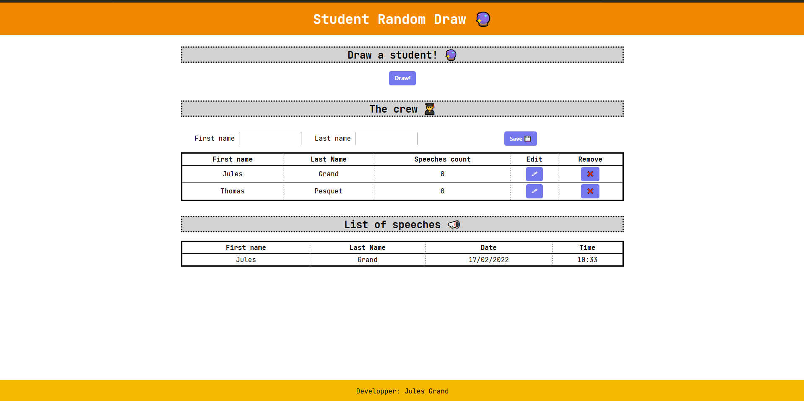

# Draw random students project

**Target** : Develop a single web page where a user can : 

- see and modify a list of students 👨‍🎓
- draw a random student from the list 🔮

## User stories

The user stories are ordered by descending priority 📉 (you should do 1. before 2. before 3. and so on).

**Important** : Completing all steps is **not** mandatory. This is not a race! However, steps 1 & 2 should be completed before project demo.

1. As an instructor I want to see the list of students in my crew 👨‍🎓
2. As an instructor I want to have a responsive web page in order to be able to use it on my laptop or my mobile phone 📱
3. As an instructor I want to be able to draw a random student from this list 🔮
4. As an instructor I want to be able to add students to my crew ➕
5. As an instructor I want to be able to remove a student from my crew ❌
6. As an instructor I want to be able to modify a student from my crew ✏
7. As an instructor I want to be able to see the list of already drawn students 👀
8. As an instructor I want the random draw function to draw only from the students that have not spoken yet to enable each student to speak once before we draw again from the whole group 🤓
9. As an inclusive instructor I want my web page to be [RGAA compliant](https://www.numerique.gouv.fr/publications/rgaa-accessibilite/methode-rgaa/criteres/) 👨‍🦽
10. As an instructor I want see two stats regarding speeches : the shortest interval between two speeches of the same person / the longest interval between two speeches of the same person 📈
11. As an instructor I want the draw function to display remaining names with a "spinning wheel" effect 🎡

## Mockups

## Constraints

- You have to use HTML and CSS for the page architecture and layout 🏗
- You can use JS (if you already know a bit) to add dynamism to the page ⚡
- You can use php, Java or any backend language to save data and handle the drawing part. Or you can use JS in the browser and it would mean that you already know some of the basics we will see next weeks 🤓

## Presentation

When you have you app ready, you will present it to the crew 😎.

1. [2 minutes max] You will present how your app is working [demo]
2. [10 minutes max] You will show how you coded the features [code review]
   1. HTML structure
   2. CSS rules
   3. App logic (back-end / front-end)
3. [3 minutes max] You will explain how you put your app to production (if done) [industrialization]
